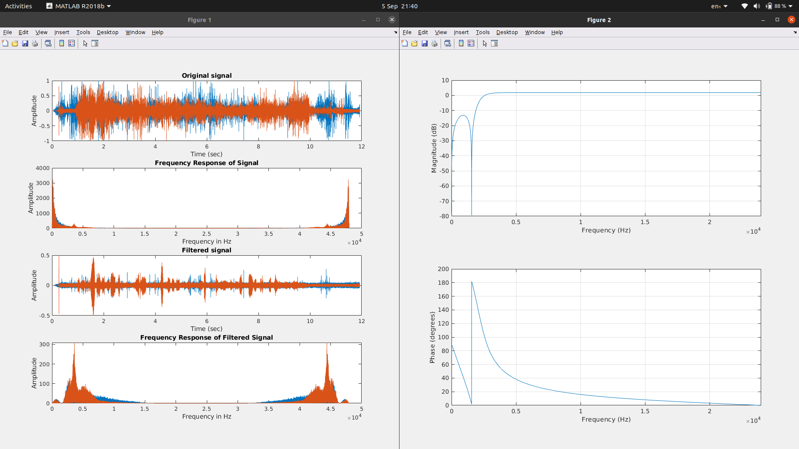
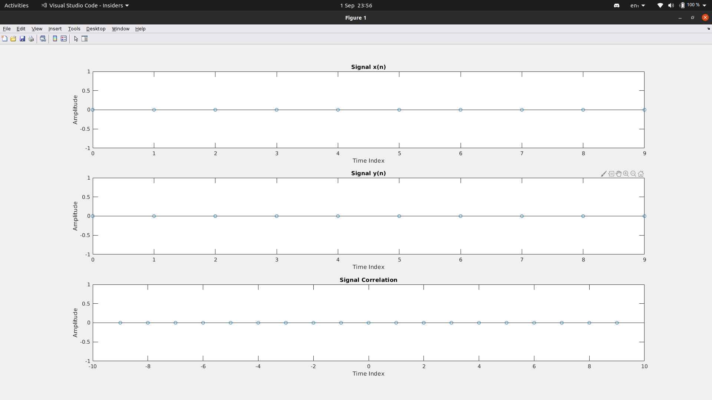
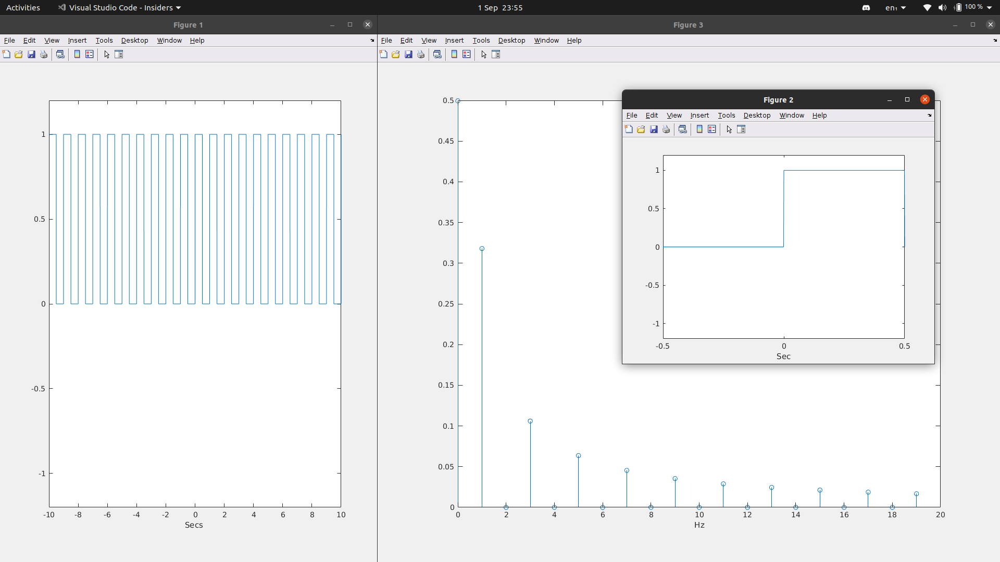
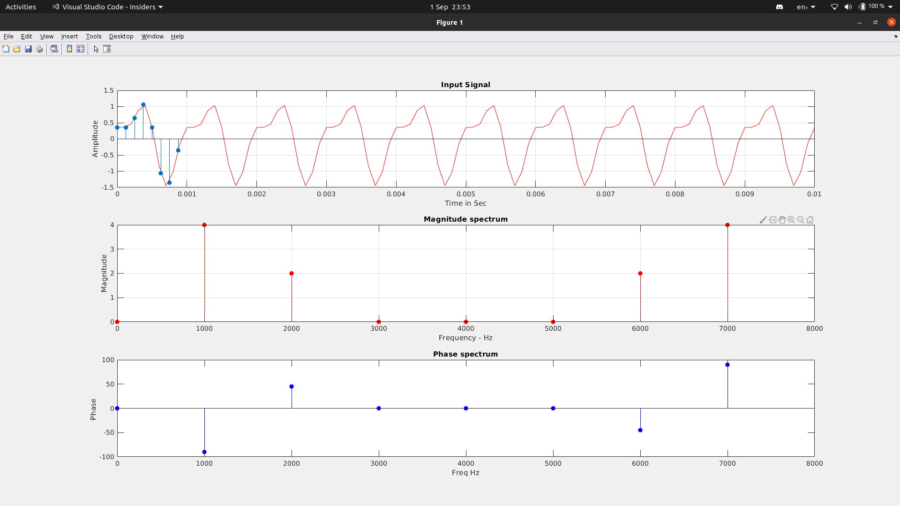
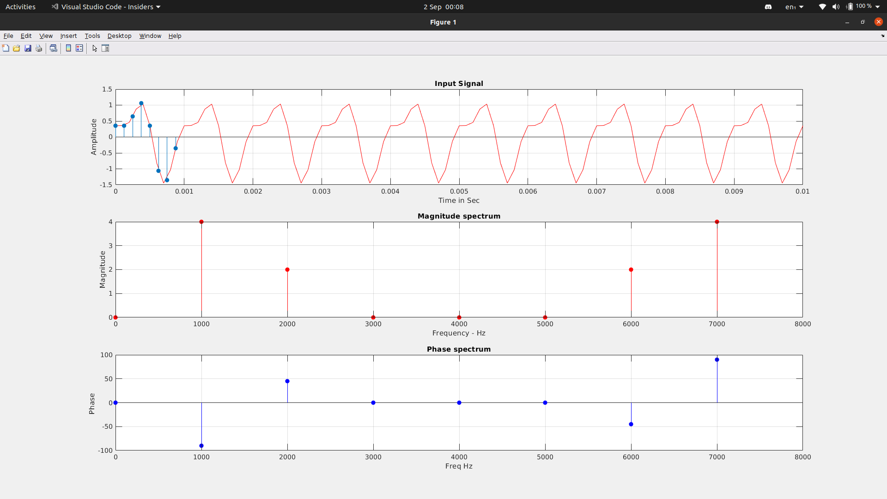
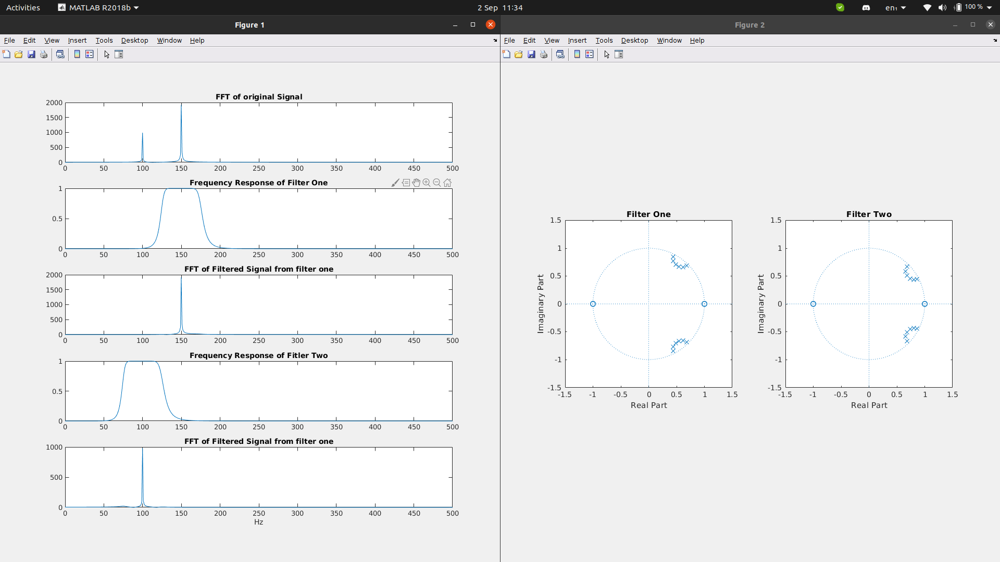
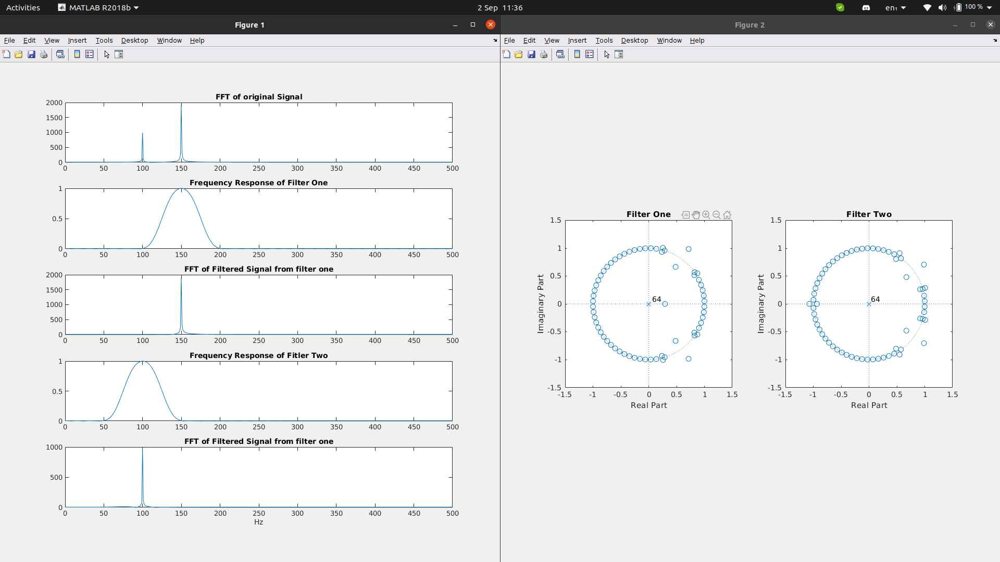

# Matlab - DSP

## To run a file in matlab from the cmd and exit.

```bash
matlab -nosplash -nodesktop -r "run('file_name.m');exit"
```

## To run matlab prompt in current directory

```bash
 matlab -nosplash -nodesktop .
```

### To run file in matlab

```
run("filename.m")
```

## To add Matlab to path (Bash)

```bash
export MATLAB='/usr/local/MATLAB/R2018b'
export PATH="$MATLAB/bin:$PATH
```

### Assignment



### LAB6



### LAB7



### LAB8



### LAB9



### LAB10



### LAB11


